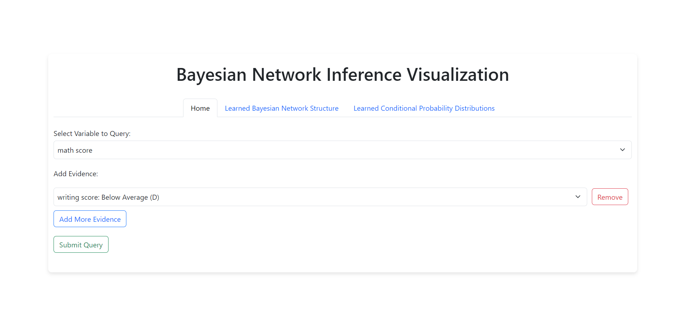
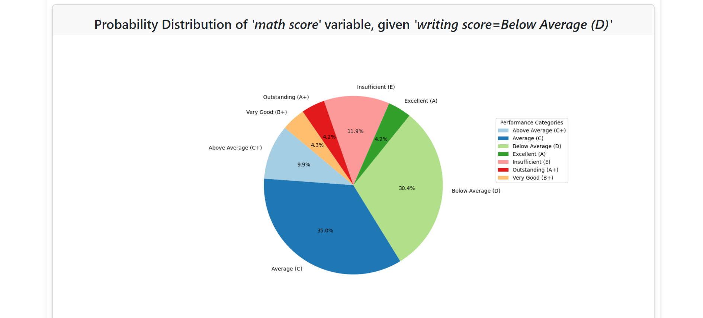
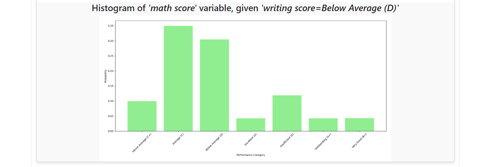
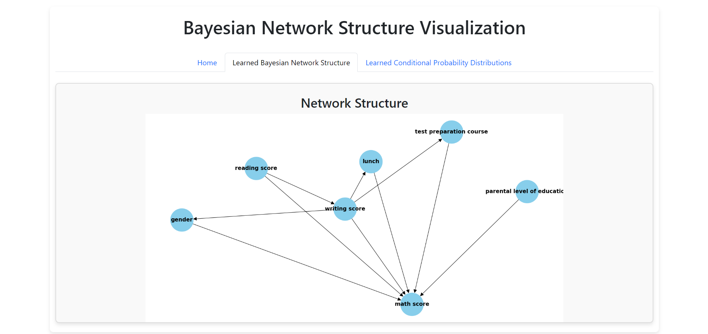
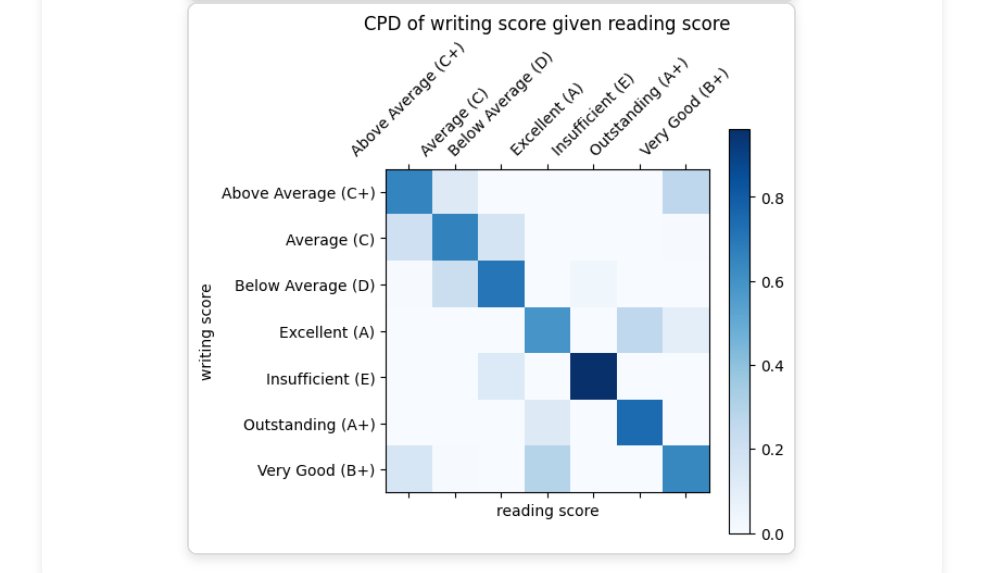

# Bayesian Network Inference and Learning 📊
This project involves the development and implementation of a Bayesian Network for inference and learning. The focus is on inference and visualization on dataset called `StudentsPerformance.csv` from Kaggle. It can be accessed from [here.](https://www.kaggle.com/datasets/spscientist/students-performance-in-exams)
- The notebook used for **structure learning** and **parameter learning** can be accessed from [here.](https://drive.google.com/drive/folders/1fDbTtTWB4_LIUR75VmxPX2LDeCUn8kkN?usp=sharing)

## Table of Contents 📃
- [Overview](#overview)
- [Features](#features)
- [Installation](#installation)
- [Dataset](#dataset)
- [Web Application](#web-application)
- [Demo](#demo)

## Overview
The project includes:
- Learning the structure of the Bayesian Network from data. It was done using `Hill Climb Search` algorithm using `K2score` metric for comparison of different models.
- The `Conditional Probabily Distribution` table was fitted using `Maximum Liklihood Estimation`.
- Performing inference to predict the probability distribution of `query variables` given `evidence`.
- Inference is done using `Variable Elimination algorithm`.
- Visualizing the Conditional Probability Distributions (CPDs) and the learned network structure.
## Features
- Structure Learning: Used `Hill Climb Search` with `K2Score` as scoring method.
` Inference: Perform probabilistic inference using the learned Bayesian Network.
- Visualization: Visualize the network structure and CPDs.
- Web Interface: A Flask web application for interacting with the Bayesian Network model.
## Installation
#### 1. Clone the repository:
```commandline 
git clone https://github.com/Tangsang2003/Bayesian-Network-Inference-and-Learning.git
```

#### 2. Create a virtual environment and activate it:

```bash
python -m venv venv
source venv/bin/activate  # On Windows, use `venv\Scripts\activate`
```
#### 3. Install the required packages:

```bash
pip install -r "requirements.txt"
```
#### 4. Run the Flask web application: 

```bash
python app.py
```

## Dataset
 - The project uses `StudentsPerformance.csv` from Kaggle. It cam be accessed from [here.](https://www.kaggle.com/datasets/spscientist/students-performance-in-exams)
 - It contains approximately 1000 instances and 8 columns namely:
   - gender
   - ethnicity/race
   - parental level of education
   - lunch
   - test preparation
   - math score
   - writing score
   - reading score

## Web Application
- A Flask web application has been implemented which provides an interface for interacting with the Bayesian Network model. 
- Users can query the network and visualize the results.
- Three pages are available:
  - Home: The main page with options to query the network.
  - Learned Structure: Visualizes the learned network structure.
  - CPDs: Visualizes the learned Conditional Probability Distribution.


## Demo
*1.* *Querying for 'math score' given 'writing score of Below Average (D)'*

*2. Result of given query in Pie Chart*

*3. Result of given query in Histogram*

*4. Structure of the Network Used*

*5. One among many of the CPDs learned ('CPD of writing Score given Reading Score')*


<hr>


